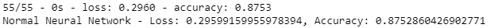
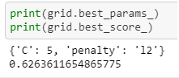

# Project Background
Over a period of nine years in deep space, the NASA Kepler space telescope has been out on a planet-hunting mission to discover hidden planets outside of our solar system.
To help process this data, you will create machine learning models capable of classifying candidate exoplanets from the raw dataset using scikit-learn.

### Preprocess the Data

* Preprocess the dataset prior to fitting the model.
* Perform feature selection and remove unnecessary features.
* Use MinMaxScaler to scale the numerical data.
* Separate the data into training and testing data.

### Tune Model Parameters

* Use GridSearch to tune model parameters.
* Tune and compare at least two different classifiers.

### Summary of Findings

The models looked at are normal neural network / deep learning, logistic regression, and SVM (support vector machine). 

Normal neural network accuracy:

Logistic regression score:

SVM score:

The normal neural network accuracy of 0.875 is the best of all 3 models. The loss of about 0.296 has room for improvement. This model is fairly good enough to predict new exoplanets; however, it may be improved by a higher number of epochs and/or an additional hidden layer.
